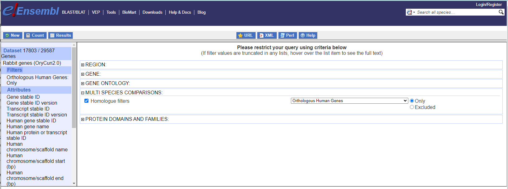
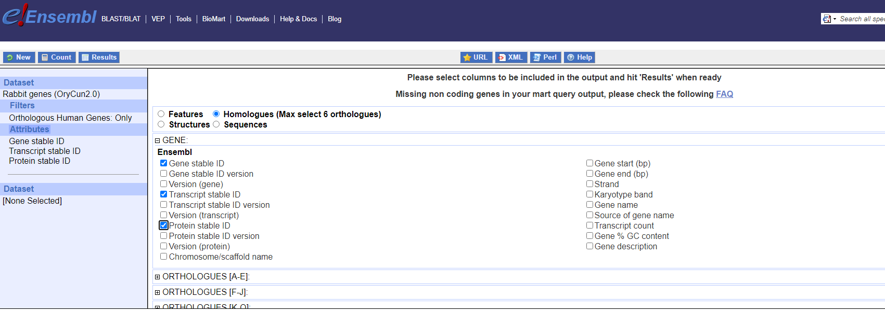
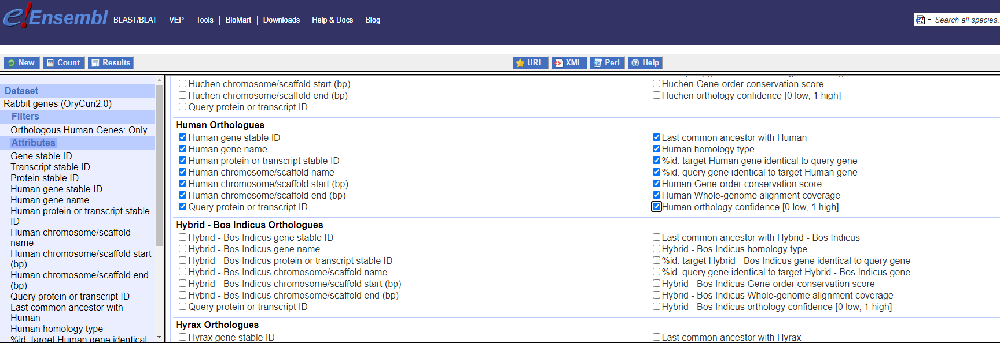
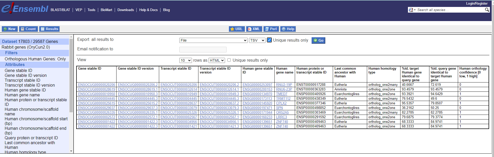

# Obtain the human orthologous genes from BioMart

Create filter:


Select attributes:



Obtain results:


URL:
```
http://www.ensembl.org/biomart/martview/5924038d177af8995ae133b86a1cc0a0?VIRTUALSCHEMANAME=default&ATTRIBUTES=ocuniculus_gene_ensembl.default.homologs.ensembl_gene_id|ocuniculus_gene_ensembl.default.homologs.ensembl_transcript_id|ocuniculus_gene_ensembl.default.homologs.ensembl_peptide_id|ocuniculus_gene_ensembl.default.homologs.hsapiens_homolog_ensembl_gene|ocuniculus_gene_ensembl.default.homologs.hsapiens_homolog_associated_gene_name|ocuniculus_gene_ensembl.default.homologs.hsapiens_homolog_ensembl_peptide|ocuniculus_gene_ensembl.default.homologs.hsapiens_homolog_chromosome|ocuniculus_gene_ensembl.default.homologs.hsapiens_homolog_chrom_start|ocuniculus_gene_ensembl.default.homologs.hsapiens_homolog_chrom_end|ocuniculus_gene_ensembl.default.homologs.hsapiens_homolog_canonical_transcript_protein|ocuniculus_gene_ensembl.default.homologs.hsapiens_homolog_subtype|ocuniculus_gene_ensembl.default.homologs.hsapiens_homolog_orthology_type|ocuniculus_gene_ensembl.default.homologs.hsapiens_homolog_perc_id|ocuniculus_gene_ensembl.default.homologs.hsapiens_homolog_perc_id_r1|ocuniculus_gene_ensembl.default.homologs.hsapiens_homolog_goc_score|ocuniculus_gene_ensembl.default.homologs.hsapiens_homolog_wga_coverage|ocuniculus_gene_ensembl.default.homologs.hsapiens_homolog_orthology_confidence&FILTERS=ocuniculus_gene_ensembl.default.filters.with_hsapiens_homolog.only&VISIBLEPANEL=resultspanel
```


# Orthology quality-controls
We have two methods to provide quality scores for orthologue pairs:

* Gene order conservation (GOC) score
* Whole genome alignment score

These methods are completely indepenent of each other and of the orthology inference itself. The scores can be used to determine how likely it is that the orthologue pairs are real.

<a href="https://www.ensembl.org/info/genome/compara/Ortholog_qc_manual.html" target="_blank">https://www.ensembl.org/info/genome/compara/Ortholog_qc_manual.html</a>

# Extract categories from orthologous genes


Retrieve the human categories from the orthologous genes:

```
python  categorize_orthologs.py  -im data/rabbit/mart_export.tsv -ic1 data/human_202306.uniprot.tsv -ic2 data/rabbit/rabbit_202306.uniprot.tsv -o data/rabbit/rabbit_202306_with_human_orthologs.uniprot.tsv
```


Obtain the Relation Table with the human categories from the orthologous genes:

```
python "S:/U_Proteomica/UNIDAD/DatosCrudos/jmrodriguezc/projects/iSanXoT-dbscripts/src/create_rt.py"    -ii data/rabbit/rabbit_202306_with_human_orthologs.uniprot.tsv -o data/rabbit/rabbit_202306_with_human_orthologs.q2c.tsv -i "Protein" -j "cat_GO_C:cat_GO_F:cat_GO_P:cat_KEGG:cat_PANTHER:cat_Reactome" -nj Categories
```


